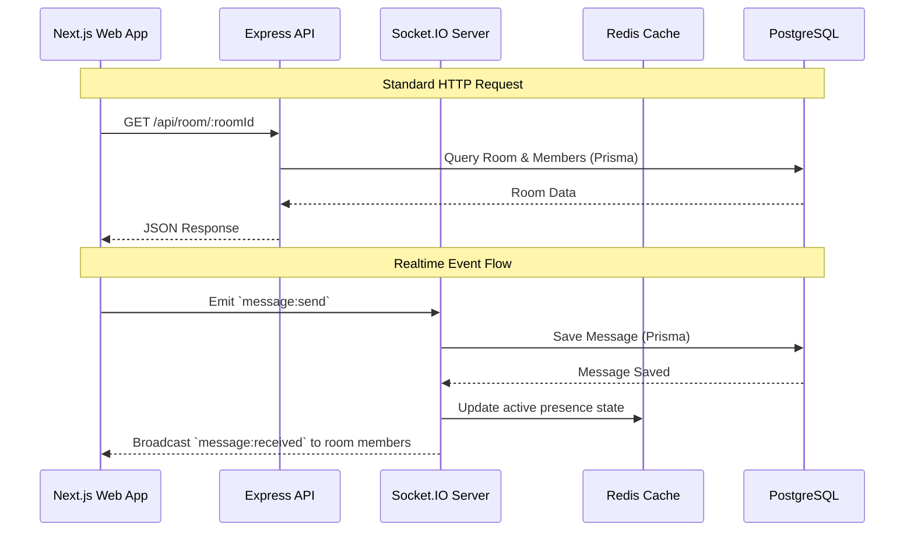

# Architecture

BridgeRoom is built as a monorepo using [Turborepo](https://turborepo.dev). The system utilizes a modern JavaScript/TypeScript stack to deliver a real-time, highly interactive user experience.

## Monorepo Structure

```text
Bridge-Room/
├── apps/
│   ├── server/       # Express REST API & Socket.IO backend
│   └── web/          # Next.js frontend application
├── packages/
│   ├── eslint-config/   # Shared ESLint configuration
│   ├── shared/          # Shared Zod schemas and TypeScript types
│   ├── typescript-config/ # Shared TSConfig
│   └── ui/              # Shared UI components (shadcn)
```

## System Components

### 1. Web Application (`apps/web`)

A Next.js 16 (React 19) application utilizing the App Router.

- **State**: Client state uses `zustand` (e.g., auth store), server state is managed via `@tanstack/react-query`.
- **Styling**: Tailwind CSS v4 and reusable components from `packages/ui` (shadcn/ui).
- **Communication**: REST API calls via `axios` and Real-Time events via `socket.io-client`.

### 2. Backend Server (`apps/server`)

A Node.js service using Express 5.

- **API Layer**: Layered architecture separating Routes, Controllers, Services, and Repositories.
- **Realtime Layer**: Socket.IO server handling stateful connections, chat events, and presence.
- **Validation**: Zod (often referencing schemas from `packages/shared`).

### 3. Database Layer (PostgreSQL)

Persistent data storage managed by Prisma ORM (`@prisma/client` and `@prisma/adapter-pg`). Stores users, rooms, memberships, messages, and delivery receipts.

### 4. Caching & Message Broker (Redis)

Utilized by the Socket.IO layer (via `ioredis`) to manage ephemeral state (active rooms, typing presence, user online status).

## High-Level Request Flow


